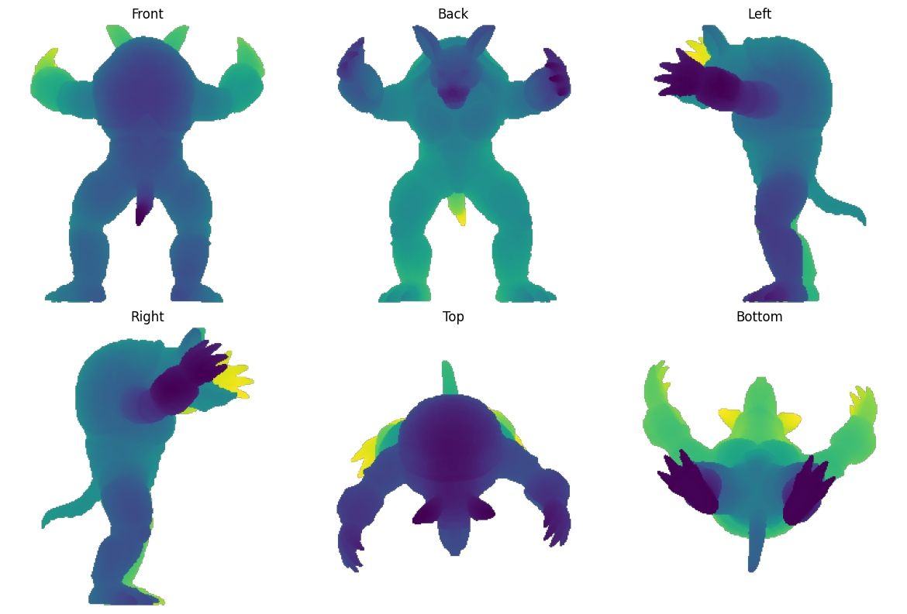
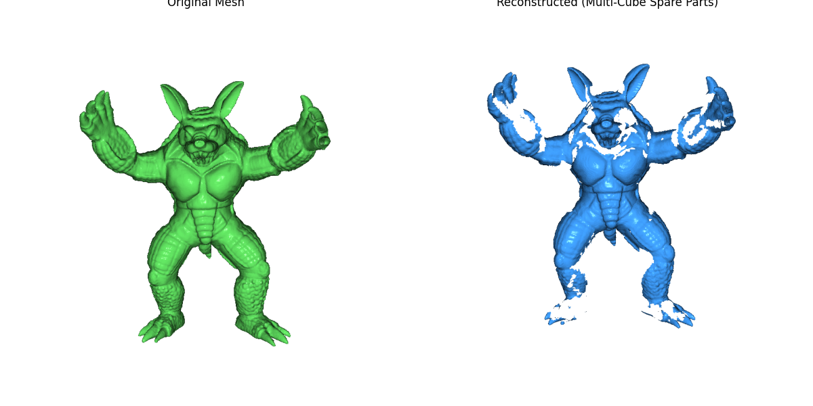

# 3DMeshizer: Cube Height Map Based 3D Mesh Compression


3DMeshizer is a research prototype investigating a novel method for extreme 3D mesh compression using **Cube Height Maps** and **Multi-Cube Geometric Partitioning**. Instead of storing massive lists of vertices and faces, this pipeline encodes high-resolution 3D geometry into lightweight 2D depth maps, achieving an **~80x compression ratio** with minimal loss of visual fidelity.

## 🚀 The Core Concept

Instead of storing vertices directly, the algorithm calculates a bounding cube around the mesh. Each of the six faces of the cube acts as an orthographic camera. 
1. **Raycasting**: Rays are cast inward from every pixel on a 256x256 grid for each of the 6 faces.
2. **Intersection**: The distance to the first surface intersection is recorded.
3. **Compression**: These 6 floating-point distance matrices are scaled and compressed using standard 16-bit Lossless PNG compression.
4. **Reconstruction**: The PNGs are decoded, back-projected into a dense 3D point cloud, and wrapped into a watertight mesh using Poisson Surface Reconstruction.

<p align="center">
  
  <br>
  <em>Six orthogonal depth maps generated from the bounding cube.</em>
</p>

## 🧩 The "Spare Parts" Algorithm (Handling Occlusions)

A standard 6-camera setup suffers from **topological loss**—it cannot see self-occlusions, deep cavities, or complex gaps (like the inside of a mouth or gaps between arms). 

Instead of relying on heavy, hallucinatory Deep Learning Diffusion models to guess the missing geometry, 3DMeshizer introduces a mathematically rigorous **Multi-Cube Partitioning** ("Spare Parts") algorithm:
1. **Boolean Subtraction**: The algorithm identifies all triangles on the original mesh that were *not* hit by the global cameras.
2. **Partitioning**: It chops off these hidden triangles and clusters them into isolated "spare parts".
3. **Local Encoding**: Each spare part is bounded by its own local, tight-fitting cube and encoded at a lower resolution (e.g., 64x64).
4. **Fusion**: During decoding, the spare parts are snapped perfectly back into global spatial coordinates before surface reconstruction.

## 📊 Results & Performance

Tested on the standard Stanford Armadillo mesh (348,000 vertices, typically ~15 MB).

| Method | File Size | Encoding Time |
| :--- | :--- | :--- |
| Original `.ply` | ~15.0 MB | N/A |
| Baseline Height Maps (Float NPZ) | ~921 KB | ~0.05 s |
| **3DMeshizer (16-bit PNG)** | **~188 KB** | **~0.03 s** |

**Reconstruction Quality (Multi-Cube):**
* **Chamfer Distance**: `0.0115` (Relative to a 2.0 bounding box scale)
* **Normal Consistency**: `97.2%`

### Visual Comparison

<p align="center">
  
  <br>
  <em>Original Mesh (Left) vs. Reconstructed from Compressed PNGs (Right)</em>
</p>

## ⚙️ Installation & Usage

1. Clone the repository and install the dependencies:
```bash
git clone https://github.com/BitsJayMehta173/3DMeshizer.git
cd 3DMeshizer
pip install -r requirements.txt
```
*(Note: Installing `pyembree` alongside trimesh is highly recommended for massive speedups in raycasting)*

2. Run the Baseline single-cube pipeline:
```bash
python main.py
```

3. Run the advanced Multi-Cube "Spare Parts" pipeline to resolve occlusions:
```bash
python main_multicube.py
```

4. Launch the Interactive 3D Visualizer to inspect the results:
```bash
python visualize_interactive.py
```
*(Hotkeys inside the visualizer: 'W' for Wireframe, 'S' for Solid mode)*

## 📁 Project Structure

* `src/raycasting.py`: Mesh normalization and ray generation.
* `src/multi_cube_partitioning.py`: Core occlusion-handling logic.
* `src/compression.py`: Gzip, NPZ, and PNG compression wrappers.
* `src/decoder.py`: Point cloud back-projection and Poisson reconstruction.
* `src/evaluation.py`: Distance metrics and normal consistency checking.
* `results/plots/`: Saved visual outputs and comparison charts.
