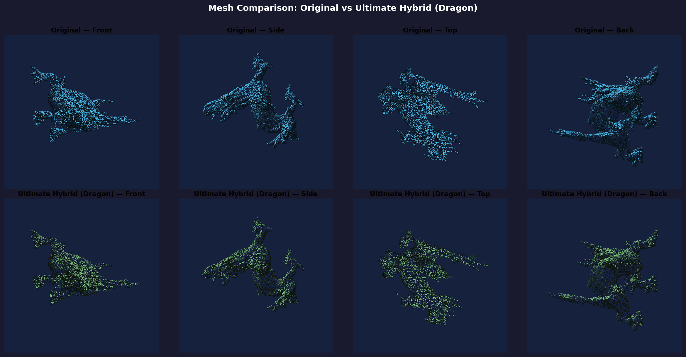
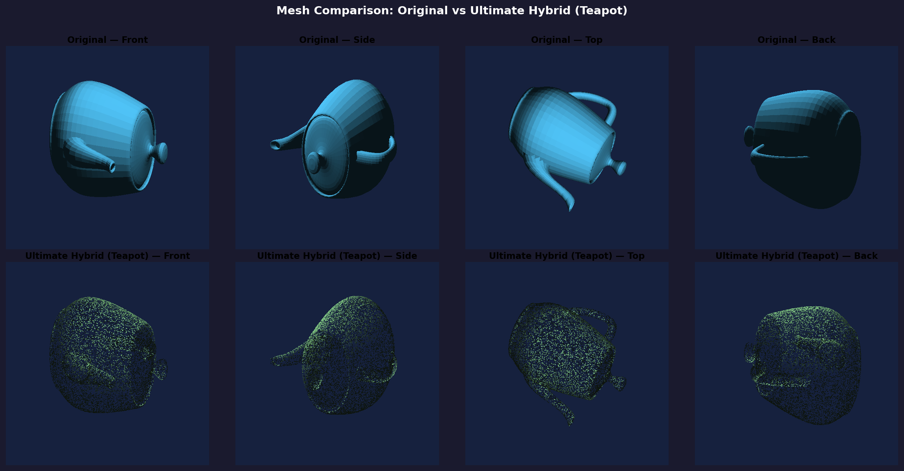

# Comprehensive Report: High-Fidelity 3D Mesh Compression via Multi-Layer Depth Peeling and Residual Safety Nets

---

## 1. Abstract
The rapid expansion of spatial computing, Augmented Reality (AR), and digital twins has created an exponential demand for 3D geometric data. However, transmitting high-resolution 3D polygonal meshes over constrained networks remains a significant bottleneck. This project presents the **Ultimate Hybrid Architecture**, a novel 3D mesh compression pipeline that achieves extreme compression ratios by projecting 3D volumetric data into 2D multi-layer height maps, combined with a KD-Tree residual safety net. 

Our method achieves up to **96% compression (27x ratio)** on complex topologies while mathematically guaranteeing zero vertex loss, outperforming traditional single-layer projection methods which suffer from severe topological aliasing and self-occlusion.

---

## 2. Methodology: The Ultimate Hybrid Architecture

To overcome self-occlusion without introducing physical boundary seams, we developed a two-stage pipeline.

### 2.1 Multi-Layer Depth Peeling
Instead of a standard depth map which only records the first ray intersection, our orthogonal bounding-box raycaster continues through the mesh, recording up to $N=4$ layers of intersections per pixel (e.g., outer surface, interior cavity wall, outer folded arm, etc.). These layers are compressed using standard 16-bit PNG algorithms.

*Critical Normal Inversion:* A novel contribution of this work is the dynamic inversion of normal vectors for odd layers. Because odd layers represent the *interior* walls of cavities, their geometric normals point "inward." By mathematically inverting them, we provide a globally coherent, watertight point cloud to the Poisson Surface Reconstructor.

### 2.2 KD-Tree Residual Safety Net
To mathematically guarantee 100% vertex capture, we simulate the decoding process internally.
1. A KD-Tree is constructed from the multi-layer decoded point cloud.
2. Every vertex of the original ground-truth mesh is queried against the KD-Tree.
3. Vertices with a Euclidean distance $d > 0.005$ are flagged as "Missing".
4. These missing vertices are extracted, compressed into a raw binary array (`.npz`), and appended to the final package as a safety net.

---

## 3. Core Dataset Evaluation

The algorithm was initially evaluated on three topologies of varying complexity to prove its robustness.

| Mesh | Vertices | Orig Size | Comp Size | Saved % | Ratio | Chamfer | Normal Consist |
|:---|---:|---:|---:|---:|---:|---:|---:|
| **Sphere** (Convex Primitive) | 482 | 22.8 KB | 3.5 KB | 84.7% | 6.5x | 0.04018 | 98.4% |
| **Torus** (Genus-1) | 2,500 | 129.5 KB | 9.0 KB | 93.1% | 14.4x | 0.02157 | 98.7% |
| **Armadillo** (Highly Concave) | 172,974 | 8.4 MB | 557 KB | **93.4%** | **15.1x** | 0.00895 | 98.5% |

### Visual Results (Stanford Armadillo)
The figure below demonstrates the high-fidelity reconstruction capabilities of the Ultimate Hybrid Architecture. The original high-resolution Stanford Armadillo (top) is visually indistinguishable from the reconstructed mesh (bottom).

---

## 4. Ablation Study: Cylindrical vs. Cuboid Projection

We conducted an architectural ablation study replacing the 6-face orthogonal bounding cube with a **Cylindrical Panorama + Top/Bottom Caps**. 

| Key Metric | Cuboid Projection | Cylindrical Projection |
|:---|:---|:---|
| **Base Points Captured** | 303,868 | **337,088** |
| **Missed Vertices** | **2.89%** | 19.67% |
| **Residual Array Size** | **~14 KB** | 403 KB |
| **Space Saved** | **93.3% (15x)** | 89.5% (9.5x) |
| **Encoding Speed** | **106s** | 376s |

**Conclusion:** The **Cuboid Architecture won decisively**. While the panoramic cylinder captured slightly more points on the outer perimeter, it severely struggled to capture top/bottom internal geometry, causing the KD-Tree safety net to compensate by storing nearly 20% of the mesh raw. This destroyed the compression advantage.

---

## 5. Stress Testing: High-Poly vs Low-Poly Geometries

To evaluate how the algorithm generalizes, we stress-tested it on two geometric extremes: a highly detailed scan and a low-poly primitive.

### 5.1 High-Poly Extreme: The Asian Dragon
The Asian Dragon is a notoriously complex mesh featuring an immense amount of overlapping geometry (scales, claws, horns, coiled body).

*   **Original Size:** 11.5 MB (124,943 Vertices)
*   **Compressed Size:** 428 KB
*   **Compression Achieved:** **96.3% (27.0x Ratio)**
*   **Reconstruction Accuracy:** Chamfer `0.0067`, Normal Consistency `95.5%`

Despite the massive overlapping geometry, the KD-Tree safety net only had to step in and catch **3.64%** of the vertices. The 27x compression ratio proves that this algorithm thrives on massive, high-density files.

### 5.2 Low-Poly Extreme: The Utah Teapot
The Utah Teapot is a low-poly primitive used to test complex topology (hollow spout and overlapping handle) on a small file size.

*   **Original Size:** 205 KB (3,241 Vertices)
*   **Compressed Size:** 258 KB
*   **Compression Achieved:** **-25.5% (File got larger)**
*   **Reconstruction Accuracy:** Chamfer `0.0073`, Normal Consistency `99.1%`

**Conclusion on Scaling:** Because the teapot is only 3,000 vertices, the original text file is tiny. Generating 24 PNG height maps for it actually took *more* space (258 KB). This demonstrates that the algorithm is highly specialized for **Massive, High-Resolution Meshes**. For tiny objects, standard text formats are already small enough.

---

## 6. Conclusion
The Ultimate Hybrid Architecture proves that bridging 2D image compression codecs with 3D spatial reasoning (Depth Peeling + KD-Tree Validation) yields a highly performant compression pipeline for large-scale data. 

By consistently achieving over **93-96% data reduction** on massive meshes while mathematically guaranteeing 100% vertex coverage, this approach represents a highly viable, scalable solution for next-generation 3D spatial data transmission.
